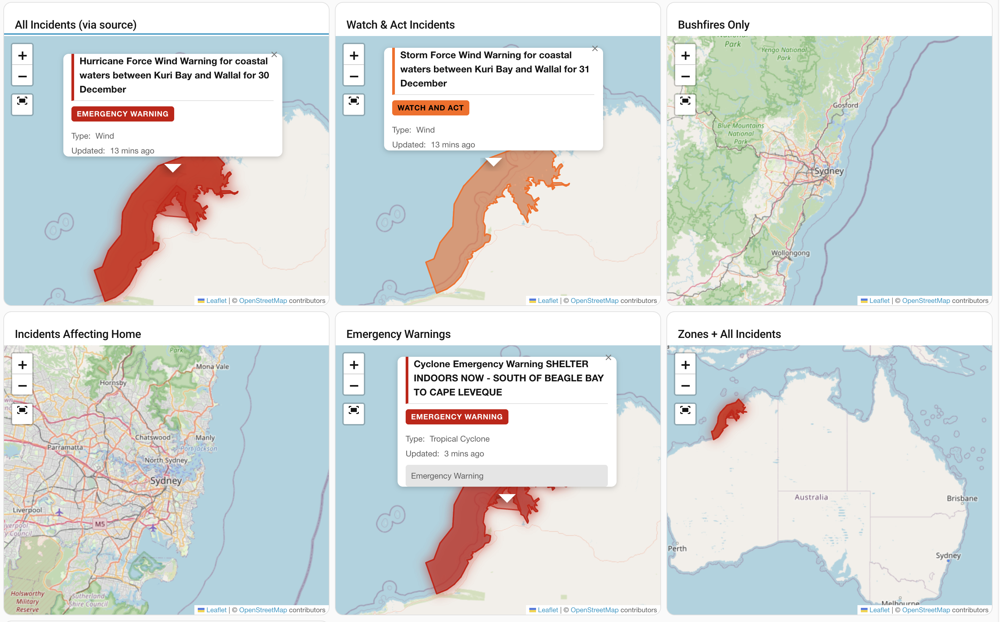

<div align="center">

# ABC Emergency Map Card

### Interactive Emergency Incident Map for Home Assistant

[](https://github.com/hacs/integration)
[](https://github.com/troykelly/lovelace-abc-emergency-map/releases)
[](https://github.com/troykelly/lovelace-abc-emergency-map/commits/main)
[](LICENSE)

[](https://www.home-assistant.io/)
[](https://leafletjs.com/)

**A custom Lovelace card that displays Australian emergency incidents on an interactive map with polygon boundaries, animations, and the Australian Warning System color scheme.**

### Quick Install

[](https://my.home-assistant.io/redirect/hacs_repository/?owner=troykelly&repository=lovelace-abc-emergency-map&category=plugin)

[Getting Started](docs/getting-started.md) | [Configuration](docs/configuration.md) | [Features](docs/features.md) | [Troubleshooting](docs/troubleshooting.md)

---



*Card showing various configurations: All Incidents, Watch & Act filtering, Bushfires only, Incidents Affecting Home, Emergency Warnings, and Zones overlay*

</div>

---

## Why This Card?

Home Assistant's native map card only supports **point markers**. Emergency incidents often have **polygon boundaries** (fire perimeters, flood zones, storm cells) that are critical for situational awareness.

This card uses [Leaflet.js](https://leafletjs.com/) to render those polygons while maintaining full compatibility with standard Home Assistant map card features.

| Feature | Native HA Map | ABC Emergency Map Card |
|---------|---------------|------------------------|
| Point markers | Yes | Yes |
| Entity tracking | Yes | Yes |
| Zone display | Yes | Yes |
| History trails | Yes | Yes |
| **Polygon boundaries** | No | **Yes** |
| **Alert level colors** | No | **Yes** |
| **Incident animations** | No | **Yes** |
| **Severity-based layering** | No | **Yes** |

---

## Features

### Emergency Incident Display
- **Polygon Rendering** - Incident boundaries displayed as actual polygons, not just points
- **Australian Warning System Colors** - Severity-based coloring (Emergency Warning, Watch and Act, Advice, Information)
- **Severity Layering** - Higher severity incidents render on top for visibility
- **Smooth Transitions** - Morphing polygon boundaries when incidents update

### Animations
- **Pulse Effects** - New incidents glow/pulse to draw attention
- **Update Animations** - Visual feedback when incident data changes
- **Badge Notifications** - Incident count with severity indicator

### Home Assistant Integration
- **Entity Markers** - Display person, device_tracker, and geo_location entities
- **Zone Rendering** - Show Home Assistant zones as circles
- **History Trails** - Display entity movement history
- **Theme Support** - Auto-detects HA theme (light/dark)

### Accessibility & UX
- **WCAG 2.1 AA Compliant** - Keyboard navigation, screen reader support
- **Responsive Design** - Works on mobile, tablet, and desktop
- **Visual Editor** - Full configuration UI in Lovelace
- **Reduced Motion** - Respects user preferences

---

## Quick Start

### Prerequisites

1. **Home Assistant 2024.1+**
2. **ABC Emergency Integration** - Required for incident data

   [](https://my.home-assistant.io/redirect/hacs_repository/?owner=troykelly&repository=homeassistant-abcemergency&category=integration)
   [](https://my.home-assistant.io/redirect/config_flow_start/?domain=abcemergency)

### Installation via HACS (Recommended)

Click the button below to add this card to HACS:

[](https://my.home-assistant.io/redirect/hacs_repository/?owner=troykelly&repository=lovelace-abc-emergency-map&category=plugin)

**Or manually:**

1. Open HACS in Home Assistant
2. Go to **Frontend** > **Custom repositories**
3. Add `https://github.com/troykelly/lovelace-abc-emergency-map` as type **Lovelace**
4. Install **ABC Emergency Map Card**
5. Refresh your browser (Ctrl+F5)

### Basic Configuration

```yaml
type: custom:abc-emergency-map-card
title: Emergency Map
geo_location_sources:
  - sensor.abc_emergency_YOUR_INSTANCE_incidents_total
```

Replace `YOUR_INSTANCE` with your ABC Emergency integration instance name (e.g., `auremer`, `treehouse`).

> **Important:** You must configure `geo_location_sources` to specify which ABC Emergency sensor provides the incident data. Without this, no incidents will be displayed.

### Manual Installation

<details>
<summary>Click to expand manual installation steps</summary>

1. Download `abc-emergency-map-card.js` from the [latest release](https://github.com/troykelly/lovelace-abc-emergency-map/releases)
2. Copy to `config/www/community/abc-emergency-map-card/`
3. Add the resource to your Lovelace configuration:

```yaml
resources:
  - url: /local/community/abc-emergency-map-card/abc-emergency-map-card.js
    type: module
```

</details>

---

## Configuration Options

### Common Options

| Option | Type | Default | Description |
|--------|------|---------|-------------|
| `title` | string | - | Card title |
| `entities` | string[] | - | Entities to display (person, device_tracker) |
| `default_zoom` | number | 10 | Initial zoom level (1-20) |
| `hours_to_show` | number | 24 | Hours of history to display |
| `dark_mode` | string | auto | Theme mode: `auto`, `light`, `dark` |

### Display Options

| Option | Type | Default | Description |
|--------|------|---------|-------------|
| `show_zones` | boolean | true | Show Home Assistant zones |
| `show_warning_levels` | boolean | true | Show ABC Emergency polygons |
| `show_history` | boolean | false | Show entity movement trails |
| `show_badge` | boolean | true | Show incident count badge |
| `auto_fit` | boolean | true | Auto-zoom to show all entities |

### Dynamic Entity Discovery

Use `geo_location_sources` to dynamically discover incidents from ABC Emergency sensors:

```yaml
type: custom:abc-emergency-map-card
title: Watch & Act Incidents
geo_location_sources:
  - sensor.abc_emergency_auremer_watch_and_acts
```

See the [full configuration reference](docs/configuration.md) for all 40+ options.

---

## Australian Warning System

This card uses the official Australian Warning System color scheme:

| Level | Color | Meaning |
|-------|-------|---------|
| **Emergency Warning** | Red (#cc0000) | You are in immediate danger and need to take action now |
| **Watch and Act** | Orange (#ff6600) | Conditions are changing - prepare to take action |
| **Advice** | Yellow (#ffcc00) | An incident is occurring - stay informed |
| **Information** | Blue (#3366cc) | General information about an event |

For more details, see [Australian Warning System reference](docs/australian-warning-system.md).

---

## Keyboard Navigation

When the map is focused:

| Key | Action |
|-----|--------|
| Arrow keys | Pan the map |
| `+` / `-` | Zoom in/out |
| `Home` | Reset view to fit all content |

---

## Documentation

- [Getting Started Guide](docs/getting-started.md) - First-time setup
- [Configuration Reference](docs/configuration.md) - All configuration options
- [Features Documentation](docs/features.md) - Detailed feature explanations
- [Troubleshooting](docs/troubleshooting.md) - Common issues and solutions
- [Generic GeoJSON Guide](docs/generic-geojson.md) - Using with non-ABC sources
- [Example Configurations](docs/examples/) - Copy-paste examples

---

## Development

```bash
pnpm install      # Install dependencies
pnpm run dev      # Build with watch
pnpm run build    # Production build
pnpm run lint     # ESLint
pnpm run typecheck # TypeScript check
```

See [CONTRIBUTING.md](CONTRIBUTING.md) for contribution guidelines.

---

## Safety Notice

> **This card is for informational purposes only.**
>
> Always follow official emergency services advice. Do not rely solely on this card for emergency decisions. If you are in danger, call **000** (Australia) immediately.
>
> For official emergency information, visit [ABC Emergency](https://www.abc.net.au/emergency) or your state emergency services.

---

## Related Projects

- [ABC Emergency Integration](https://github.com/troykelly/homeassistant-abcemergency) - The backend integration that provides incident data

---

## License

Apache License 2.0 - see [LICENSE](LICENSE) for details.

---

<div align="center">

**Made with care for the Australian Home Assistant community**

*This project is not affiliated with or endorsed by the Australian Broadcasting Corporation (ABC) or any emergency services agency.*

</div>
